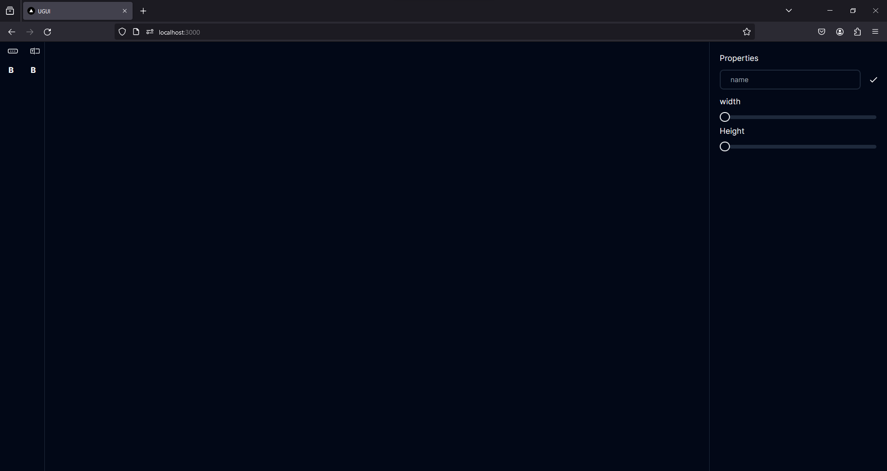

 * Demo https://universal-gui-editor-ugui.vercel.app/
 * This file contains the documentation for the Universal GUI Editor.
 * ![Universal GUI Editor]
 * 

   
 * The Universal GUI Editor is a tool that allows users to create and edit graphical user interfaces (GUIs) in a universal and platform-independent manner. It provides a user-friendly interface and supports various features such as drag-and-drop functionality, customizable widgets, and real-time preview.
 
 * This project is open source and welcomes contributions from anyone.
 
